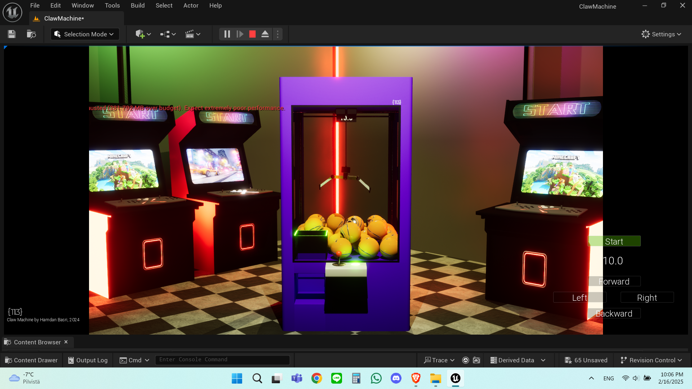
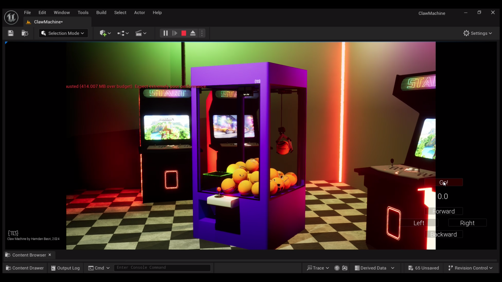

# 🎮 Cyber Claw: Neon Arcade 🕹️  
_A Cyberpunk-Themed First-Person Claw Machine Game in Unreal Engine_  

  

## 🚀 Overview  
**Cyber Claw: Neon Arcade** is a **3D first-person arcade game** developed in **Unreal Engine**, set in a futuristic **cyberpunk arcade**. Players control a high-tech claw machine, moving it within a limited time to grab prizes and collect rewards.  

The game follows the **3S principle (Simple, Short, Satisfying)** for a quick and engaging experience.  

## 🎯 Current Features (In Progress)  
✅ **First-Person Camera Control** – Players can rotate the camera left and right when starting.  
✅ **Timed Claw Control** – Move the claw forward, backward, left, and right within **10 seconds** before it automatically descends.  
✅ **Automatic Prize Collection** – Claw lowers, grabs a **ball (placeholder prize)**, and moves it to the prize hole before resetting.  
✅ **Basic Prize System** – Simple physics-based grabbing and dropping.  

  

## 🔧 Tech Stack  
- 🎮 **Engine:** Unreal Engine 5 (Blueprint-based)  
- 💻 **Language:** Blueprint Scripting  
- ⚙️ **Physics:** Unreal Engine Physics for object interaction  

## 📌 Planned Features (Future Updates)  
🔹 **UI System** – Main menu, in-game interface, and prize collection.  
🔹 **Music & Sound Effects** – Cyberpunk-inspired background music & SFX.  
🔹 **Detailed Prize System** – Players can view their winnings in a **collection menu**.  
🔹 **Improved Physics & Prizes** – More realistic claw grabbing and diverse prize types.  
🔹 **Scoring & Progression** – Track wins and unlock special rewards.  

## 🏗️ Development Status  
✅ Basic game loop & claw movement  
✅ Timer-based claw control & automatic prize drop  
🚧 Prize collection system (In Progress)  
🚧 UI & Sound Effects (Coming Soon)  

## Contributors
👤 Game Developer: [Pawanrat Santiyanon](https://www.linkedin.com/in/pawanrat-santiyanon/)  
📫 Portfolio: [Website Portfolio Link](https://nookpawanrat.github.io/portfolio/)  
📧 Contact: pawanrat.santiyanon@gmail.com  

### Asset Credits
🖼️ Assets downloaded from: [cgtrader.com](https://www.cgtrader.com/)  
